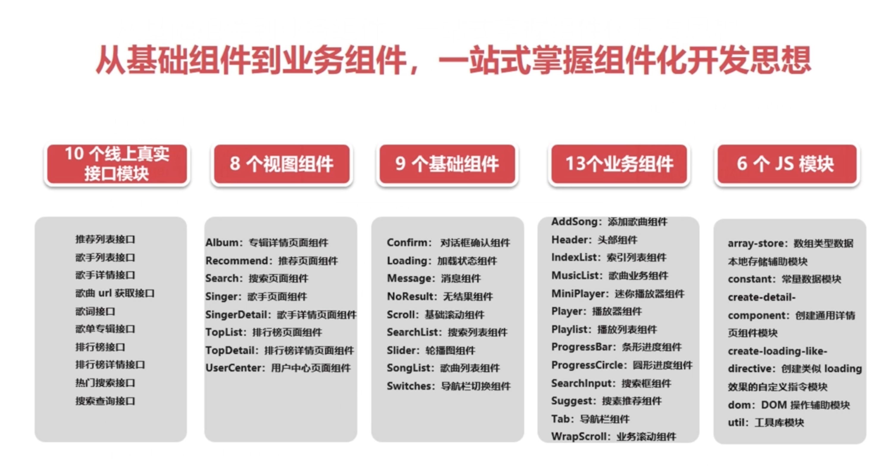
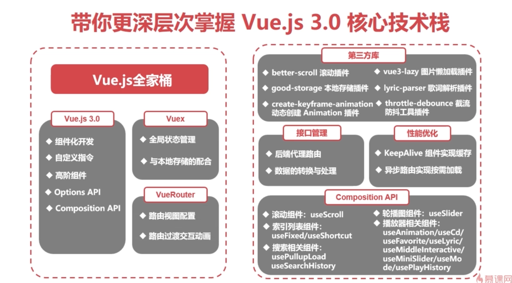

# 资料
1. [Vue3官网](https://cn.vuejs.org/)  
2. [Vue CLI脚手架](https://cli.vuejs.org/zh/) Vue脚手架
3. [pinia](https://pinia.vuejs.org/zh/) 状态管理库
4. [vue-router](https://router.vuejs.org/) 路由库

5. [better-scroll](https://better-scroll.github.io/docs/zh-CN/) 滚动库
6. [vue3-lazy](https://github.com/ustbhuangyi/vue3-lazy) 图片懒加载
7. [create-keyframe-animation](https://github.com/HenrikJoreteg/create-keyframe-animation) 用js创建动画

# Vue3知识点
1. 自定义指令
  * loading
  * no-result
2. 组合式函数封装
  * use-scroll
  * use-slider
  * use-fixed
  * use-shortcut
  * use-animate
  * use-cd
  * use-lyric
  * use-middle-interactive
  * use-mini-slider
  * use-mode
3. 插槽
  * `<slot></slot>`
4. 父子级页面传参
  * 父 -> 子：`prop`
  * 子 -> 父：`emit`
5. 组合式使用如何获取自定义组件的属性和方法
  * 需要在封装自定义组件中通过`defineExpose`把需要的方法和属性暴露出去，才能在外部调用
6. transition 过渡动画使用
  * 方式1：内置组件：
  ```js
  <transition name="move"></transition>
  ```
  * 方式2：js钩子使用：
  ```js
  <Transition
  @enter="onEnter"
  @after-enter="onAfterEnter"
  @leave="onLeave"
  @after-leave="onAfterLeave"
>
  <!-- ... -->
</Transition>
  ```
7. 生命周期
```js
onMounted(() => {
  <!-- 组件挂载完成之后执行 -->
})
onUnmounted(() => {
  <!-- 组件卸载完成之后执行 -->
})
```
8. Teleport
  * `<teleport></teleport>` 是一个内置组件，它可以将一个组件内部的一部分模版”传送“到该组件的DOM结构外层的位置去
9. 组件 `v-model`
  * 组件定义
  ```js
  // search-input.vue
  <script setup>
  import { computed, defineProps, defineEmits } from 'vue'

    const props = defineProps({
      modelValue: String
    })

    const emit = defineEmits(['update:modelValue'])

    const query = computed({
      get () {
        return props.modelValue
      },
      set (value) {
        emit('update:modelValue', value)
      }

    })

    </script>

    <template>
      <div class="search-input">
        <input
          class="input-inner"
          v-model="query"
        />
      </div>
    </template>
  ```
  * 组件使用
  ```js
  <script setup>
  import { ref } from 'vue'
  import SearchInput from '@/components/search/search-input'

  const query = ref('')
  </script>
  <template>
    <div class="search">
      <div class="search-input-wrapper">
        <SearchInput v-model="query"></SearchInput>
      </div>
    </div>
  </template>

  ```

# 总结



